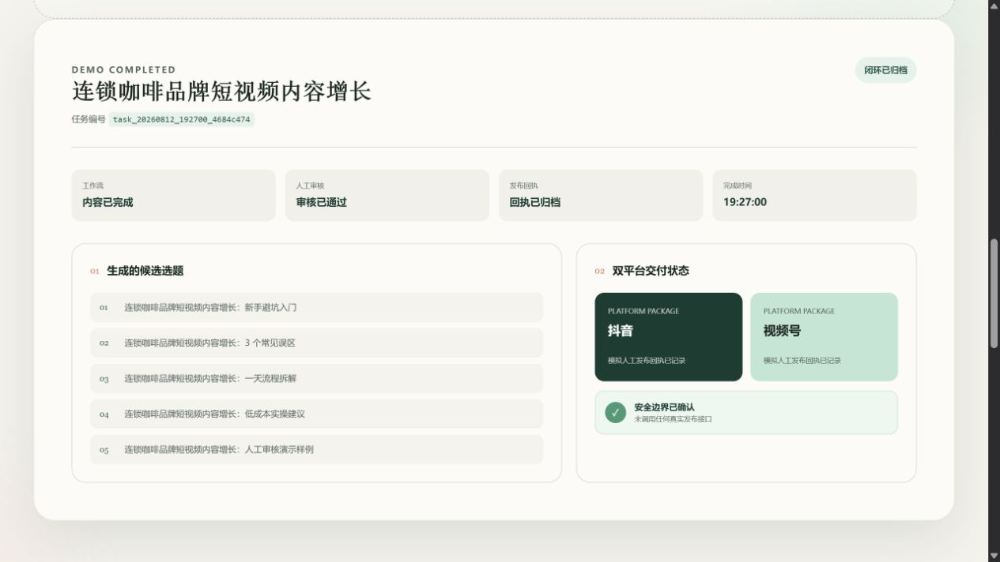

# 潮生内容工场 TideCraft

> 让灵感随潮而生，让内容有序抵达。

**潮生内容工场（TideCraft）** 是一套本地运行的短视频内容生产与人工审核系统。用户输入一个内容主题后，系统可以生成候选选题和脚本、整理审核材料、生成双平台发布准备包，并记录人工审核和发布结果。

项目适合用于客户功能演示、内部内容策划、短视频工作流验证，以及搭建可追踪、可审计的内容运营流程。

当前版本已经完成 `phase-07` 收尾，处于冻结维护状态。内部工程名仍为 `lobster-farm`，Python 包名仍为 `lobster_farm`，以兼容现有脚本和配置。

## 前端功能展示



上图为本地客户演示完成后的功能结果页，展示候选选题、人工审核状态、抖音与视频号发布准备以及安全边界。截图使用模拟主题和 dry-run/mock 数据，不包含真实客户资料或平台账号信息。

## 可以实现什么

### 1. 内容选题与脚本生成

- 输入一个行业、产品或营销主题
- 自动生成 5 条候选短视频选题
- 为每条选题生成脚本内容
- 汇总标题、内容方向和审核材料

当前默认使用安全的演示数据和占位生成逻辑，便于离线展示完整流程。

### 2. 飞书审核消息

- 生成适合人工审核的飞书消息
- 默认使用 dry-run，只展示消息内容，不真实发送
- 配置本地凭据后，可切换到真实飞书适配器
- 飞书模块采用可替换接口，不影响核心工作流

### 3. 视频生成结果准备

- 默认通过 mock provider 生成视频占位结果
- 支持配置真实视频 API provider
- 记录视频任务状态和结果摘要
- 将视频结果与脚本、审核信息一起导出

### 4. 人工审核工作流

- 按任务查看待审核内容
- 支持审核通过、拒绝和退回修改
- 保存审核人、审核备注和审核时间
- 阻止不符合规则的状态流转

### 5. 双平台发布准备

- 审核通过后生成抖音发布准备包
- 同时生成视频号发布准备包
- 整理发布所需的标题、脚本和内容资料
- 支持按平台和状态查看待发布队列

### 6. 人工发布回执

- 人工登录平台完成发布后写回结果
- 记录发布平台、发布状态、链接、操作人和备注
- 支持记录发布失败原因
- 完成后可以归档任务并保留审计记录

### 7. 客户前端演示

- 提供面向客户的可视化演示页面
- 输入客户行业或主题即可展示完整业务流程
- 页面展示候选选题、审核进度和双平台交付状态
- 演示只在本机打开，不访问真实平台或真实账号

## 功能流程

```text
输入主题
  → 生成候选选题与脚本
  → 生成飞书审核消息和视频结果
  → 导出待审核任务
  → 人工审核
  → 生成抖音与视频号发布准备包
  → 人工完成平台发布
  → 写回发布结果
  → 归档任务
```

项目不提供抖音、视频号或其他平台的自动登录与自动正式发布功能。

## 安装

### 环境要求

- Windows 10/11 或 WSL2/Linux
- Python 3.10 或更高版本
- 客户前端演示需要本机浏览器

项目默认没有第三方 Python 依赖，使用 dry-run/mock 模式时不需要任何真实密钥。

### Windows 安装

在项目根目录打开 PowerShell：

```powershell
python -m venv .venv
.\.venv\Scripts\Activate.ps1
python -m pip install -r requirements.txt
Copy-Item .env.example .env
.\scripts\verify.ps1
```

如果公司安全策略不允许执行 PowerShell 脚本，请不要绕过策略，应在获得批准的环境中运行。更详细的环境准备方法见 [安装说明](docs/install.md)。

### WSL2/Linux 安装

```bash
python3 -m venv .venv
source .venv/bin/activate
python3 -m pip install -r requirements.txt
cp .env.example .env
./scripts/verify.sh
```

首次安装建议保持 `.env` 中的默认安全配置：

```text
RUN_MODE=dry-run
FEISHU_ADAPTER=dry-run
VIDEO_PROVIDER=mock
```

## 使用

### 客户演示

Windows 用户直接双击：

```text
一键启动客户演示.cmd
```

浏览器将打开：

```text
http://127.0.0.1:8765
```

在页面输入客户行业或内容主题，点击“开始客户演示”即可。演示结束后双击 `一键停止客户演示.cmd`。

### 完整命令行 Demo

Windows 用户可以双击：

```text
一键运行演示.cmd
```

WSL2/Linux 用户执行：

```bash
./scripts/demo.sh --guided
```

Demo 会安全模拟选题、脚本、审核、双平台发布准备、发布回执和归档，不调用真实外部服务。

### 正常创建内容任务

Windows：

```powershell
.\scripts\run-dev.ps1
```

WSL2/Linux：

```bash
./scripts/run-dev.sh
```

任务结果保存在本地 `data/`、`exports/` 和 `logs/` 目录中。这些运行数据默认不会进入 Git。

### 写回人工审核结果

```powershell
python .\services\orchestrator\src\review.py --task-id "task_xxx" --review-status approved --reviewed-by "审核人" --review-note "审核通过"
```

### 写回人工发布结果

```powershell
python .\services\orchestrator\src\publish.py --task-id "task_xxx" --platform douyin --publish-status manually_published --publish-url "发布链接" --published-by "操作人" --publish-note "已人工发布"
```

支持的平台标识为：

- `douyin`：抖音
- `wechat_channels`：视频号

完整的审核和发布操作见 [人工审核说明](docs/review-workflow.md) 与 [人工发布回执说明](docs/publishing-workflow.md)。

## Windows 快捷入口

| 快捷按钮 | 用途 |
| --- | --- |
| `一键启动客户演示.cmd` | 打开客户前端演示 |
| `一键停止客户演示.cmd` | 停止本地演示服务 |
| `一键运行演示.cmd` | 运行完整安全 Demo |
| `一键完整验证.cmd` | 检查项目是否可正常运行 |
| `一键隐私检查.cmd` | 检查隐私和密钥风险 |
| `一键GitHub上传前检查.cmd` | 执行 GitHub 上传前检查 |
| `打开使用说明书.cmd` | 打开中文使用说明书 |

以上按钮不会自动提交代码、上传 GitHub 或发布短视频。

## 安全说明

- 默认使用 dry-run/mock，不调用真实外部服务
- 客户演示只监听本机地址 `127.0.0.1`
- 不读取浏览器 Cookie、个人数据或平台账号密码
- 不在仓库中保存真实密钥、Token 或 Webhook
- 不支持短视频平台自动正式发布
- `.env`、运行数据、导出结果和日志不会进入 Git

如需上传 GitHub，请先运行 `一键GitHub上传前检查.cmd`，并阅读 [隐私审计报告](PRIVACY_AUDIT.md) 和 [GitHub 上传清单](GITHUB_UPLOAD_CHECKLIST.md)。

## 进一步了解

- [中文使用说明书](使用说明书.md)
- [项目当前状态](CURRENT_STATUS.md)
- [项目结项说明](PROJECT_CLOSURE.md)
- [安装说明](docs/install.md)
- [客户前端演示说明](docs/customer-demo.md)
- [配置说明](docs/configuration.md)
- [架构说明](docs/architecture.md)
- [运行与排错](docs/runbook.md)

当前项目已发布在 GitHub 公开仓库中，但尚未配置开源许可证，因此未授予明确的开源使用许可。项目负责人已在公开前重新执行隐私复核。
